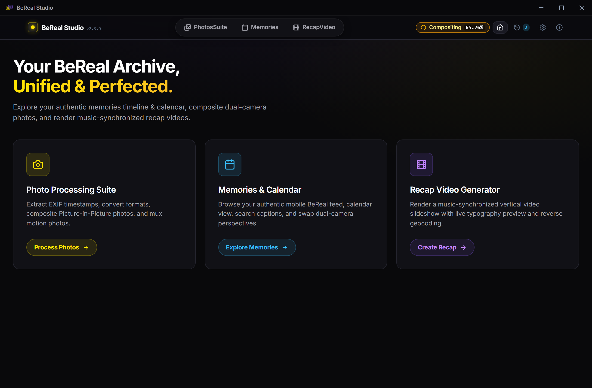
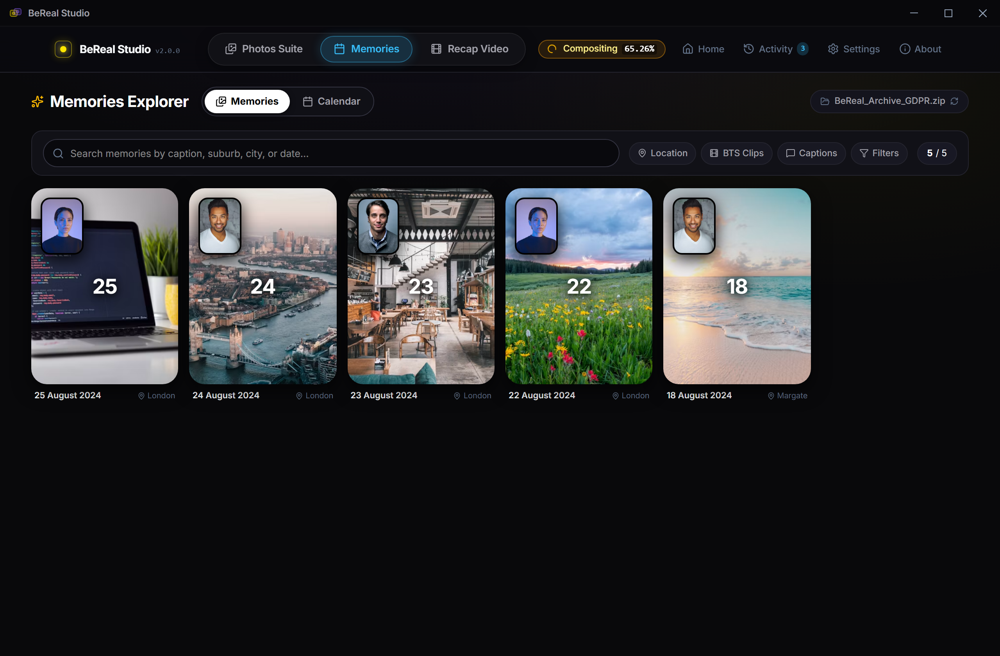
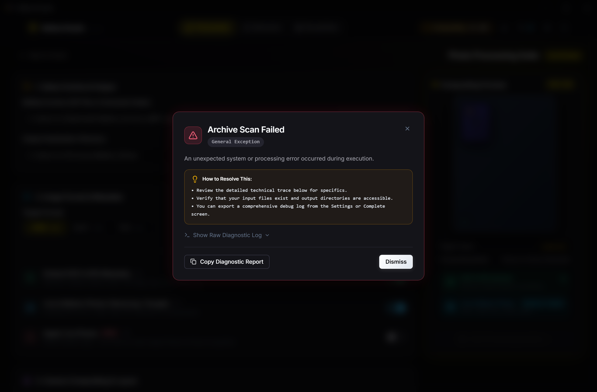
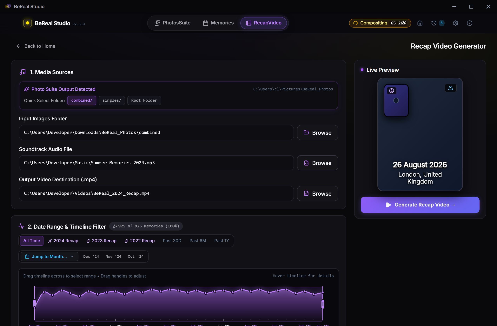
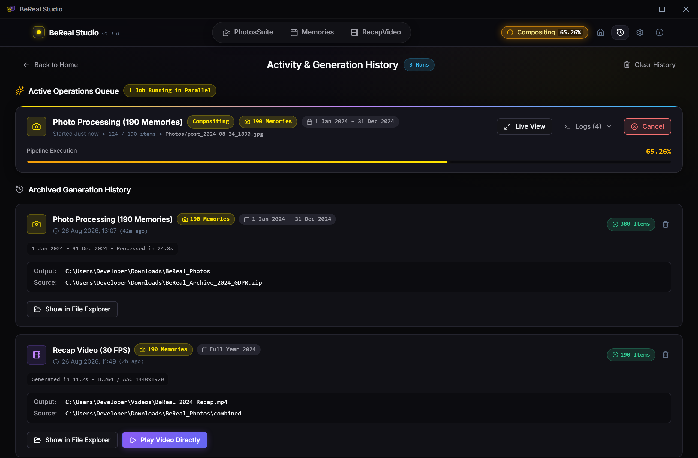

# BeReal Studio 📸 🎬

<div align="center">
  <h3>Unified, Local-First Desktop Suite for BeReal GDPR Data Exports</h3>
  <p>Explore your memories in an authentic mobile feed & calendar, restore metadata, composite dual-camera memories, mux motion photos, and generate music-synchronized recap videos — 100% locally and privately.</p>
  <p>
    <a href="https://github.com/NotToxel/BeRealStudio/releases/latest"></a>
    <a href="https://github.com/NotToxel/BeRealStudio/actions/workflows/release.yml"></a>
    <a href="https://github.com/NotToxel/BeRealStudio/blob/master/LICENSE"></a>
    
    
    
    
  </p>
</div>

---

## 📥 Downloads & Installation

Download the official standalone release for your platform from the [Latest Release Page](https://github.com/NotToxel/BeRealStudio/releases/latest):

| Platform | Format / Architecture | Direct Download Link |
| :--- | :--- | :--- |
|  **Windows** | `.exe` (64-bit NSIS Setup) | [⬇️ **Download for Windows (Installer)**](https://github.com/NotToxel/BeRealStudio/releases/latest/download/BeReal.Studio_2.3.0_x64-setup.exe) |
|  **Windows** | `.exe` (64-bit Standalone) | [⬇️ **Download for Windows (Portable)**](https://github.com/NotToxel/BeRealStudio/releases/latest/download/bereal-studio.exe) |
|  **macOS** | `.dmg` (Apple Silicon M1/M2/M3/M4) | [⬇️ **Download for macOS (Apple Silicon .dmg)**](https://github.com/NotToxel/BeRealStudio/releases/latest/download/BeReal.Studio_2.3.0_aarch64.dmg) |
|  **macOS** | `.app.tar.gz` (Universal .app Bundle) | [⬇️ **Download for macOS (.app Bundle)**](https://github.com/NotToxel/BeRealStudio/releases/latest/download/BeReal-Studio-macOS.app.tar.gz) |
|  **Linux** | `.AppImage` (x86_64 Universal) | [⬇️ **Download for Linux (.AppImage)**](https://github.com/NotToxel/BeRealStudio/releases/latest/download/BeReal.Studio_2.3.0_amd64.AppImage) |
|  **Linux** | `.deb` (Debian / Ubuntu x86_64) | [⬇️ **Download for Linux (.deb)**](https://github.com/NotToxel/BeRealStudio/releases/latest/download/BeReal.Studio_2.3.0_amd64.deb) |

> 💡 *Looking for earlier releases, source archives, or release notes? Explore all [GitHub Releases](https://github.com/NotToxel/BeRealStudio/releases).*

---

## ⚡ Prerequisites & External Tools

BeReal Studio is engineered with native Rust algorithms to minimize dependencies. Depending on the features you use:

| Tool | Status | Purpose | Installation |
| :--- | :--- | :--- | :--- |
| **FFmpeg** | **Required for Videos** | Rendering recap videos (`.mp4`), audio sync, and video PIP compositing. | •  **Windows**: `winget install Gyan.FFmpeg`<br>•  **macOS**: `brew install ffmpeg`<br>•  **Linux**: `sudo apt install ffmpeg` |
| **ExifTool** | **Optional / Recommended** | Extended video metadata & QuickTime `.mov` ContentIdentifier tagging.<br>*(**Note**: Photos, EXIF/IPTC restoration, Samsung motion photos, and Apple Live Photos use our built-in 100% pure Rust engine and do not require ExifTool).* | •  **Windows**: `winget install OliverBetz.ExifTool`<br>•  **macOS**: `brew install exiftool`<br>•  **Linux**: `sudo apt install libimage-exiftool-perl` |

> 🔍 *You can check and verify your system's FFmpeg and ExifTool status anytime inside BeReal Studio under **Settings ⚙️ &rarr; System & Dependencies**.*

---

## 🖼️ Application Showcase

<div align="center">

| 🏠 Home Dashboard & Archive Scanner | 📱 Native Memories & Calendar Explorer |
|:---:|:---:|
|  |  |

| 📸 Photo Processing Suite & Dual Perspectives | 🎬 Recap Video Generator & Audio Waveforms |
|:---:|:---:|
|  |  |

| ⚡ Active Operations & Generation History Queue |
|:---:|
|  |

</div>

---

## ✨ Key Features

### 📱 1. Native Memories & Calendar Explorer
- **Authentic BeReal Experience**: Mobile-identical dark aesthetic designed to browse your entire GDPR archive seamlessly.
- **Dual View Modes**: Switch effortlessly between a responsive **Memories Card Grid** (with viewport-filling timeline scrubber) and an interactive **Monthly Calendar Matrix** (with pinned sticky navigation).
- **Continuous Vertical Infinite Feed**: Tap any post to open a smooth, continuous vertical feed with instant auto-scroll to the selected memory.
- **Dynamic Sticky Header**: Tracks active post date and position (e.g. `18 August 2024 • 14 of 420`) as you scroll.
- **Interactive Dual-Camera Frame**:
  - **Click-to-Swap**: Flip front and back cameras instantly.
  - **Movable PIP**: Drag and reposition the selfie PIP anywhere or snap to the 4 corners.
  - **Inline BTS Player**: Stream Behind-the-Scenes live video micro-clips with a single click.
- **Smart Search & Live Compound Filtering**:
  - Filter posts by text query, GPS location, BTS clips, captions, retakes, year, month, city, and country.
  - Live dynamic count tags on all filter chips and dimension selectors update continuously as multi-level filters are applied.
- **Single-Memory Instant Export Dialog**:
  - **Picture-in-Picture & Side-by-Side**: High-resolution dual-camera composites with lossless EXIF restoration.
  - **Apple Live Photo (.jpg + .mov pair)**: Generates matching Apple Content Identifier UUID metadata (`MakerApple:17` and `com.apple.quicktime.content.identifier`) recognized natively by macOS/iOS Apple Photos and iCloud.
  - **Samsung & Google Motion Photos**: Muxes Behind-the-Scenes (BTS) videos directly into JPEG headers via Samsung SEFH binary trailers and Google MicroVideo XMP.
  - **Raw Media Clips & Camera Isolations**: Export primary camera, selfie camera, or raw MP4 video clips independently.
- **Configurable Header Display**: Customize location formatting (City/Country, Suburb, Full) and timestamp/late tag display in Settings.

---

### 📸 2. Photo Processing Suite
- **Metadata Restoration & EXIF Synchronization**: Losslessly embeds original capture dates, times, GPS coordinates, and caption descriptions into EXIF/IPTC photo headers.
- **BeReal Moment Registry & True Cycle Date Anchoring**: Accurately anchors posts taken late or past midnight to their true BeReal notification cycle dates.
- **Dual-Camera Compositing**: Recreates BeReal's signature aesthetic with rounded corners and clean borders in Picture-in-Picture and Side-by-Side layouts.
- **Dual-Angle Perspective Export**: Choose between **Standard** (primary background), **Reversed** (selfie background), or export **Both Angles** concurrently.
- **Samsung & Google Motion Photos**: Muxes Behind-the-Scenes (BTS) videos into motion photos compatible with Samsung Gallery and Google Photos *(requires JPEG format)*.
- **Visual Timeline & Date Range Filter**: Interactive monthly activity density curve and calendar picker to easily filter memories by year, month, or custom dates.
- **Fast Batch Processing**: Multi-threaded Rayon pipeline processes hundreds of archive photos in seconds.

---

### 🎬 3. Recap Video Generator
- **Music-Synchronized Recap Slideshows**: Automatically paces memories to your chosen soundtrack (MP3, WAV, M4A, AAC, FLAC) with real-time waveform visualization.
- **Dynamic Timing Curves**: Customize video pacing with quadratic ramp, even timing, accelerate, decelerate, or wave timing curves.
- **Smart Location & Date Stamps**: Formats reverse-geocoded location stamps and custom date typography on each memory slide.
- **Offline Spatial Reverse Geocoder**: Built-in in-memory GeoNames spatial index for instant, offline city/country resolution with zero network pauses.
- **Live Video Preview**: Interactive player to preview your recap sequence before rendering.
- **Background Multi-Job Queue**: Render videos and process photo batches simultaneously in the background without UI interruption.

---

## 📋 How to Download Your Archive from BeReal
 
1. Open the **BeReal** mobile app and tap your **Profile icon** (top-right).
2. Tap **Help** &rarr; Select **Contact Us**.
3. Select **Ask a Question** &rarr; Tap **Troubleshooting** &rarr; Tap **Other**.
4. Tap **Contact Us** at the bottom &rarr; Select the **Topic** dropdown.
5. Select **"I'd like to request a copy of my data"**.
6. Type a message with at least **10 characters** (e.g., *"Please provide a copy of my account data"*) and submit.
7. BeReal will deliver a secure download link via email containing your official archive ZIP (including `posts.json` and all media).
8. Once downloaded, select the ZIP or unzipped folder directly in **BeReal Studio**.

---

## 🛠️ Prerequisites (For Building from Source)

1. **Rust Toolchain:**
   - Install via [rustup.rs](https://rustup.rs) (Rust 1.78+ recommended).
2. **Package Manager & JavaScript Runtime:**
   - **Bun (Recommended for ultra-fast startup):** Install via [bun.sh](https://bun.sh) (`powershell -c "irm bun.sh/install.ps1 | iex"`).
   - **NPM / PNPM / Yarn (Fully Supported):** Standard Node.js v18+ environment works out-of-the-box.
3. **FFmpeg (For Recap Video & Motion Photos):**
   - Required for video slideshow encoding and dual-video PIP overlays.
   - **Windows:** `winget install Gyan.FFmpeg` or download from [ffmpeg.org](https://ffmpeg.org/download.html).
   - **macOS:** `brew install ffmpeg`
   - **Linux:** `sudo apt install ffmpeg`

---

## 🚀 Running Locally

You can use **Bun** (recommended) or **NPM / PNPM / Yarn**:

### Option A: Using Bun (Fastest)
```bash
# Install dependencies
bun install

# Start local desktop development server
bun run tauri dev
```

### Option B: Using NPM
```bash
# Install dependencies
npm install

# Start local desktop development server
npm run tauri dev
```

---

## 📦 Building & Packaging

To compile a self-contained release executable and installer for your operating system:

```bash
# With Bun
bun run tauri build

# With NPM
npm run tauri build
```

### Build Artifact Locations:
- **Windows:** `src-tauri/target/release/bundle/msi/BeReal Studio_2.2.1_x64_en-US.msi` or `.exe`
- **macOS:** `src-tauri/target/release/bundle/dmg/BeReal Studio_2.2.1_universal.dmg`
- **Linux:** `src-tauri/target/release/bundle/deb/bereal-studio_2.2.1_amd64.deb` or `appimage`

---

## 🧪 Testing & Verification

```bash
# Run Svelte & TypeScript diagnostics
bun run check
# or: npm run check

# Run Rust unit tests and benchmark suite
cargo test --manifest-path src-tauri/Cargo.toml
```

---

## 🏗️ Architecture & Directory Structure

```
BeRealStudio/
├── src/                                    # Frontend (SvelteKit SPA + TypeScript)
│   ├── app.html                            # Root HTML & Inter font imports
│   ├── styles/global.css                   # Custom dark design system tokens & font-faces
│   ├── lib/
│   │   ├── types.ts                        # TypeScript models & IPC interfaces
│   │   ├── tauri.ts                        # Tauri IPC bridge & typed event listeners
│   │   ├── stores.ts                       # Svelte reactive state stores
│   │   ├── memoriesStore.ts                # Memories explorer state & live compound filtering
│   │   └── fonts.ts                        # Curated built-in font definitions
│   ├── components/                         # Reusable UI Component Suite
│   │   ├── NavBar.svelte                   # Top navigation bar (Home, Photos, Recap, Settings, About)
│   │   ├── Toggle.svelte                   # Animated on/off switch
│   │   ├── Slider.svelte                   # Value range slider with value pill
│   │   ├── FilePicker.svelte               # Native folder & file dialog wrapper
│   │   ├── DateRangePicker.svelte          # Dual date pickers with monthly density histogram
│   │   ├── ProgressBar.svelte              # Streaming progress indicator
│   │   ├── LogConsole.svelte               # Color-coded live terminal log
│   │   ├── ErrorModal.svelte               # Categorized error overlay
│   │   ├── FontPicker.svelte               # Curated 7-font dropdown selector
│   │   ├── RuleEditor.svelte               # Reverse geocoding rules editor
│   │   └── memories/                       # Memories & Explorer Component Suite
│   │       ├── MemoriesGrid.svelte         # Responsive memory card grid & full-height scrubber
│   │       ├── CalendarGrid.svelte         # Interactive monthly calendar with sticky navigation
│   │       ├── DualCameraFrame.svelte      # Dual-camera frame with click-to-swap & movable PIP
│   │       ├── MemoryFeedModal.svelte      # Fullscreen continuous vertical scroll feed
│   │       ├── MemoryFilterBar.svelte      # Live compound search & dimension filters
│   │       ├── MemoryActionMenu.svelte     # Memory 3-dot dropdown menu
│   │       ├── MemoryContextMenu.svelte    # Right-click context menu
│   │       └── ExportMemoryModal.svelte    # Single-memory export dialog (Apple Live Photo & Motion Photo)
│   ├── views/                              # Application Primary Views
│   │   ├── Home.svelte                     # Main dashboard with hero & feature cards
│   │   ├── MemoriesView.svelte             # Native Memories & Calendar Explorer View
│   │   ├── ToolkitConfig.svelte            # Photo processing configuration view
│   │   ├── RecapperConfig.svelte           # Recap video configuration view with live preview
│   │   ├── Activity.svelte                 # Parallel active operations & generation history
│   │   ├── Processing.svelte               # Real-time progress & live streaming log view
│   │   ├── Complete.svelte                 # Summary metrics, output opener & log exporter
│   │   ├── Settings.svelte                 # Global defaults, FFmpeg detection & inspector tools
│   │   └── About.svelte                    # Privacy manifesto, authoring & open source credits
│   └── routes/+page.svelte                 # SPA root page router
│
├── src-tauri/                              # Rust Backend (Tauri v2)
│   ├── Cargo.toml                          # Native dependencies (image, img-parts, symphonia, rayon, etc.)
│   ├── tauri.conf.json                     # Desktop window & plugin configuration
│   ├── capabilities/default.json           # Tauri v2 security capabilities
│   ├── tests/
│   │   └── benchmark_suite.rs              # End-to-end performance benchmarking harness
│   └── src/
│       ├── main.rs & lib.rs                # Tauri entry & command registration
│       ├── state.rs                        # Global state, ProgressEmitter & log buffer
│       ├── commands/                       # IPC Command Handlers
│       │   ├── archive.rs                  # scan_archive, extract_zip (streaming)
│       │   ├── toolkit.rs                  # start_toolkit, cancel_toolkit (Rayon multi-core)
│       │   ├── recapper.rs                 # start_recapper, cancel_recapper
│       │   ├── explorer.rs                 # load_memories, export_single_memory (Live Photo & Motion Photo)
│       │   ├── settings.rs                 # load_settings, save_settings, reset_settings
│       │   ├── system.rs                   # show_in_folder, check_ffmpeg, offline geodb, analyze_audio
│       │   └── debug.rs                    # export_debug_log, get_debug_logs
│       ├── pipeline/                       # Photo Processing Logic
│       │   ├── parser.rs                   # Authoritative dataset fusion & moment registry
│       │   ├── image_ops.rs                # Format conversion, PIP & Side-by-Side compositing
│       │   ├── exif_writer.rs              # Lossless EXIF & IPTC JPEG segment injection
│       │   ├── live_photo.rs               # Apple Photos Live Photo pair (.jpg + .mov) generator
│       │   ├── motion_photo.rs             # Samsung SEFH/SEFT binary muxer & GCamera XMP
│       │   ├── video_ops.rs                # FFmpeg dual-video PIP overlay
│       │   ├── date_filter.rs              # Range filtering & density distribution
│       │   └── cleanup.rs                  # Intermediate artifact cleanup
│       └── recapper/                       # Recap Video Engine
│           ├── audio.rs                    # Symphonia audio decoding & waveform analysis
│           ├── timing.rs                   # Quadratic ramp / even timing curves
│           ├── geocoder.rs                 # Nominatim reverse geocoding & offline GeoDB
│           ├── location_rules.rs           # Country-specific location formatting engine
│           ├── font_resolver.rs            # Built-in font resolver & disk loader
│           ├── frame_renderer.rs           # Image resize & text overlay with shadows
│           └── video_encoder.rs            # Zero-copy raw RGB frame piping to FFmpeg stdin
├── package.json                            # App manifest & dependencies (v2.3.0)
└── README.md                               # User documentation & GDPR guide
```

---

## 🗺️ Future Roadmap & Upcoming Features

- [x] **📅 Native BeReal-Style Memories & Calendar Viewer** *(Completed in v2.0.0 & v2.3.0)*:
  - Monthly Memories Calendar Matrix with day thumbnails, late badges, and retake counters.
  - Interactive Feed & Lightbox with front/back camera click-to-swap and movable PIP.
  - Multi-dimensional search, hierarchical location drawers, and single-memory exports.
  - Smooth 1:1 pointer drag panning and zoom controls for high-res photo and video exploration.
  - Full Video BeReal support with synchronized dual-video playback and Side-by-Side MP4 combining.
- [x] **🍏 Apple Photos Live Photos Compatibility** *(Completed in v2.2.1)*:
  - Export paired still image (`.jpg`) and video (`.mov`) files with matching Apple Content Identifier UUID (`MakerApple:17` and `com.apple.quicktime.content.identifier`) for native drag-and-drop Live Photo recognition in Apple Photos and iCloud.
- [ ] **🏷️ Direct Caption Burn-In on Exported Photos**:
  - Optional setting to burn original BeReal captions in authentic semi-transparent rounded pill styling directly onto composited images or recap slides.
- [ ] **🎬 Recap Video Library & Gallery Viewer**:
  - In-app gallery indexing all rendered recap MP4s with playback preview, waveform scrubber, and quick actions ("Open in Player", "Show in Explorer").

---

## 💖 Credits & Open Source Lineage

**BeReal Studio** is authored and maintained by **[NotToxel](https://github.com/NotToxel)** ([GitHub Repository](https://github.com/NotToxel/BeRealStudio)).

It unifies, rewrites, and modernizes the core capabilities of three pioneer open-source projects into a single, high-performance desktop application:

- **[BeReel](https://github.com/theOneAndOnlyOne/BeReel)** *(by [@theOneAndOnlyOne](https://github.com/theOneAndOnlyOne))* — Creator of the music-synchronized BeReal recap video generator and reverse-geocoding rules engine.
- **[BeReal-GDPR-Photo-Toolkit](https://github.com/hatobi/bereal-gdpr-photo-toolkit)** *(by [@hatobi](https://github.com/hatobi))* — Pioneer of BeReal GDPR archive extraction, EXIF metadata restoration, and Picture-in-Picture photo compositing.
- **[makelive (Make Live)](https://github.com/mifi/makelive)** *(by [@mifi](https://github.com/mifi))* — Pioneer of Apple Photos Live Photo generation, inspiring our native Rust binary muxing of paired still photos (`.jpg`) and Behind-the-Scenes micro-videos (`.mov`) with synchronized Apple Content Identifier UUIDs (`MakerApple:17` EXIF & `com.apple.quicktime.content.identifier` QuickTime metadata).

---

## 📜 License

GNU General Public License v3.0 or later (GPL-3.0-or-later) &copy; 2026 NotToxel and BeReal Studio Contributors.

BeReal Studio is free and open-source software: you can redistribute it and/or modify it under the terms of the GNU General Public License as published by the Free Software Foundation, either version 3 of the License, or (at your option) any later version.
