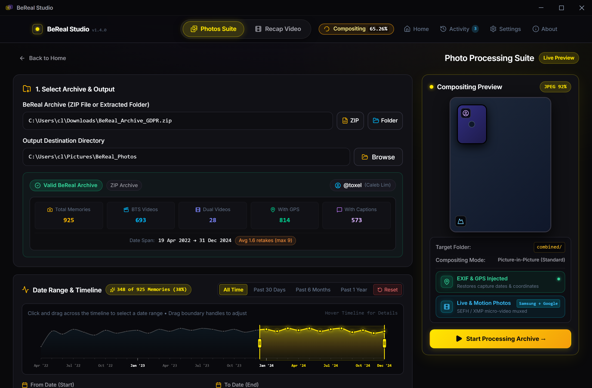
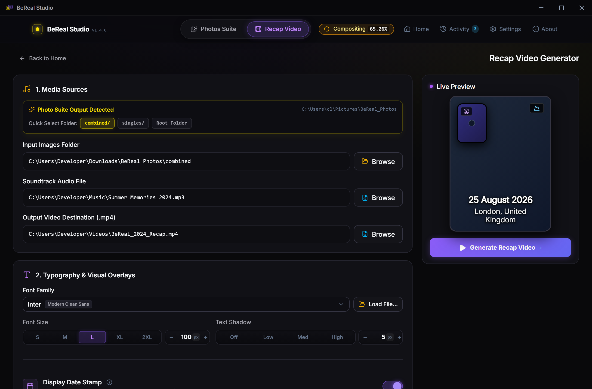
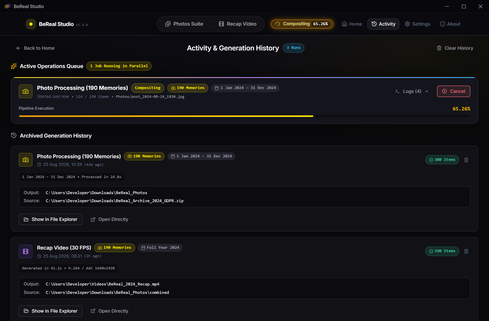

# BeReal Studio 📸 🎬

<div align="center">
  <h3>Unified, Local-First Desktop Suite for BeReal GDPR Data Exports</h3>
  <p>Restore metadata, composite dual-camera memories, mux motion photos, and generate music-synchronized recap videos — 100% locally and privately.</p>
  <p>
    <a href="https://github.com/NotToxel/BeRealStudio"></a>
    
    
    
  </p>
</div>

---

## 🖼️ Application Showcase

<div align="center">

| 🏠 Home Dashboard & Archive Scanner | 📸 Photo Processing & Dual Perspective |
|:---:|:---:|
|  |  |

| 🎬 Recap Video Generator & Audio Waveforms | ⚡ Active Operations & History Queue |
|:---:|:---:|
|  |  |

</div>

---

## ✨ Key Features

### 📸 Photo Processing Suite
- **Metadata Restoration & EXIF Synchronization:** Losslessly embeds original capture dates, times, GPS coordinates, and caption descriptions into EXIF/IPTC photo headers.
- **Authentic Dual-Camera Compositing:** Recreates BeReal's signature in-app aesthetic with rounded corners and crisp borders, supporting Picture-in-Picture and Side-by-Side layouts.
- **Dual-Angle Perspective Export:** Choose between **Standard** (primary background), **Reversed** (selfie background), or export **Both Angles** concurrently.
- **Samsung & Google Motion Photos:** Muxes Behind-the-Scenes (BTS) videos into motion photos compatible with Samsung Gallery and Google Photos.
- **Visual Timeline & Date Range Filter:** Interactive monthly activity density curve and calendar picker to easily filter memories by year, month, or custom dates.
- **Fast Batch Processing:** Multi-threaded pipeline processes hundreds of archive photos in seconds.

### 🎬 Recap Video Generator
- **Music-Synchronized Recap Slideshows:** Automatically paces memories to your chosen soundtrack (MP3, WAV, M4A, AAC, FLAC) with real-time waveform visualization.
- **Dynamic Timing Curves:** Customize video pacing with quadratic ramp, even timing, accelerate, decelerate, or wave timing curves.
- **Smart Location & Date Stamps:** Automatically formats reverse-geocoded location stamps and custom date text on each memory slide.
- **Live Video Preview:** Interactive player to preview your recap sequence before rendering.
- **Background Multi-Job Queue:** Render videos and process photo batches simultaneously in the background without UI interruption.

---

## 📋 How to Download Your Archive from BeReal
 
1. Open the **BeReal** mobile app and tap your **Profile icon** (top-right).
2. Tap **Help** &rarr; Select **Contact Us**.
3. Select **Ask a Question** &rarr; Tap **Troubleshooting** &rarr; Tap **Other**.
4. Tap **Contact Us** at the bottom &rarr; Select the **Topic** dropdown.
5. Select **"I'd like to request a copy of my data"**.
6. Type a message with at least **10 characters** (e.g., *"Please provide a copy of my account data"*) and submit.
7. BeReal will deliver a secure download link via email containing your official archive ZIP (including `posts.json` and all media).
8. Once downloaded, select the ZIP or unzipped folder directly in **BeReal Studio**.

---

## 🛠️ Prerequisites

1. **Rust Toolchain:**
   - Install via [rustup.rs](https://rustup.rs) (Rust 1.78+ recommended).
2. **Package Manager & JavaScript Runtime:**
   - **Bun (Recommended for ultra-fast startup):** Install via [bun.sh](https://bun.sh) (`powershell -c "irm bun.sh/install.ps1 | iex"`).
   - **NPM / PNPM / Yarn (Fully Supported):** Standard Node.js v18+ environment works out-of-the-box.
3. **FFmpeg (For Recap Video & Motion Photos):**
   - Required for video slideshow encoding and dual-video PIP overlays.
   - **Windows:** `winget install Gyan.FFmpeg` or download from [ffmpeg.org](https://ffmpeg.org/download.html).
   - **macOS:** `brew install ffmpeg`
   - **Linux:** `sudo apt install ffmpeg`

---

## 🚀 Running Locally

You can use **Bun** (recommended) or **NPM / PNPM / Yarn**:

### Option A: Using Bun (Fastest)
```bash
# Install dependencies
bun install

# Start local desktop development server
bun run tauri dev
```

### Option B: Using NPM
```bash
# Install dependencies
npm install

# Start local desktop development server
npm run tauri dev
```

---

## 📦 Building & Packaging

To compile a self-contained release executable and installer for your operating system:

```bash
# With Bun
bun run tauri build

# With NPM
npm run tauri build
```

### Build Artifact Locations:
- **Windows:** `src-tauri/target/release/bundle/msi/BeReal Studio_1.3.1_x64_en-US.msi`
- **macOS:** `src-tauri/target/release/bundle/dmg/BeReal Studio_1.3.1_x64.dmg`
- **Linux:** `src-tauri/target/release/bundle/deb/bereal-studio_1.3.1_amd64.deb` or `appimage`

---

## 🧪 Testing & Verification

```bash
# Run Svelte & TypeScript type checks
bun run check
# or: npm run check

# Run Rust unit tests and benchmark suite
cargo test --manifest-path src-tauri/Cargo.toml
```

---

## 🏗️ Project Architecture

```
BeRealStudio/
├── src/                                    # Frontend (Svelte 5 + SvelteKit SPA + TypeScript)
│   ├── app.html                            # Root HTML & Inter typography
│   ├── styles/global.css                   # Custom dark design system tokens
│   ├── lib/
│   │   ├── types.ts                        # TypeScript data models & IPC interfaces
│   │   ├── tauri.ts                        # Typed Tauri IPC bridge & event subscribers
│   │   ├── stores.ts                       # Reactive stores & parallel multi-job queue
│   │   ├── devMode.ts                      # Demo data generator & developer mode
│   │   └── fonts.ts                        # Curated built-in font definitions
│   ├── components/                         # Reusable UI Components
│   │   ├── NavBar.svelte                   # Global top navigation with Activity badge
│   │   ├── Toggle.svelte                   # Animated on/off switch
│   │   ├── Slider.svelte                   # Value range slider with value pill
│   │   ├── Stepper.svelte                  # Numeric stepper input
│   │   ├── FilePicker.svelte               # Native folder & file dialog wrapper
│   │   ├── DateRangePicker.svelte          # Dual date pickers with monthly density curve
│   │   ├── SpeedCurvePreview.svelte        # Visual speed curve & audio waveform canvas
│   │   ├── Modal.svelte                    # Accessible modal dialog
│   │   ├── LogConsole.svelte               # Color-coded live terminal console
│   │   ├── ErrorModal.svelte               # Categorized error overlay
│   │   └── RuleEditor.svelte               # Reverse geocoding rules editor
│   ├── views/                              # Application Primary Views
│   │   ├── Home.svelte                     # Main dashboard with hero & feature cards
│   │   ├── ToolkitConfig.svelte            # Photo processing configuration view
│   │   ├── RecapperConfig.svelte           # Recap video configuration view with live preview
│   │   ├── Activity.svelte                 # Parallel active operations & generation history
│   │   ├── Processing.svelte               # Real-time progress & live streaming log view
│   │   ├── Complete.svelte                 # Summary metrics, output opener & log exporter
│   │   ├── Settings.svelte                 # Global defaults, FFmpeg detection & offline GeoDB
│   │   └── About.svelte                    # Privacy manifesto, authoring & open source credits
│   └── routes/+page.svelte                 # SPA root page router
│
├── src-tauri/                              # Rust Backend (Tauri v2)
│   ├── Cargo.toml                          # Native dependencies (image, img-parts, symphonia, rayon, etc.)
│   ├── tauri.conf.json                     # Desktop window & plugin configuration
│   ├── capabilities/default.json           # Tauri v2 security capabilities
│   ├── tests/
│   │   └── benchmark_suite.rs              # End-to-end performance benchmarking harness
│   └── src/
│       ├── main.rs & lib.rs                # Tauri entry & command registration
│       ├── state.rs                        # Global state, ProgressEmitter & log buffer
│       ├── commands/                       # IPC Command Handlers
│       │   ├── archive.rs                  # scan_archive, extract_zip (streaming)
│       │   ├── toolkit.rs                  # start_toolkit, cancel_toolkit (Rayon multi-core)
│       │   ├── recapper.rs                 # start_recapper, cancel_recapper
│       │   ├── settings.rs                 # load_settings, save_settings, reset_settings
│       │   ├── system.rs                   # show_in_folder, check_ffmpeg, offline geodb, analyze_audio
│       │   └── debug.rs                    # export_debug_log, get_debug_logs
│       ├── pipeline/                       # Photo Processing Logic
│       │   ├── parser.rs                   # Streaming JSON parsing & monthly histogram
│       │   ├── image_ops.rs                # Format conversion, PIP & Side-by-Side compositing
│       │   ├── exif_writer.rs              # Lossless EXIF & IPTC JPEG segment injection
│       │   ├── motion_photo.rs             # Samsung SEFH/SEFT binary muxer & GCamera XMP
│       │   ├── video_ops.rs                # FFmpeg dual-video PIP overlay
│       │   ├── date_filter.rs              # Range filtering & density distribution
│       │   └── cleanup.rs                  # Intermediate artifact cleanup
│       └── recapper/                       # Recap Video Engine
│           ├── audio.rs                    # Symphonia audio decoding & waveform analysis
│           ├── timing.rs                   # Quadratic ramp / even timing curves
│           ├── geocoder.rs                 # Nominatim reverse geocoding & offline GeoDB
│           ├── location_rules.rs           # Country-specific location formatting engine
│           ├── font_resolver.rs            # Built-in font resolver & disk loader
│           ├── frame_renderer.rs           # Image resize & text overlay with shadows
│           └── video_encoder.rs            # Zero-copy raw RGB frame piping to FFmpeg stdin
├── package.json                            # App manifest & dependencies (v1.6.0)
└── README.md                               # User documentation & GDPR guide
```

---

## 🗺️ Future Roadmap & Upcoming Features

- [ ] **🍏 Apple Photos Live Photos Compatibility**:
  - Export paired still image (`.jpg`/`.heic`) and video (`.mov`) files with matching Apple Content Identifier UUID (`MakerApple:17` and `com.apple.quicktime.content.identifier` metadata) for native drag-and-drop Live Photo recognition in Apple Photos and iCloud.
- [ ] **📅 Native BeReal-Style Memories & Calendar Viewer**:
  - **Monthly Memories Calendar Matrix**: Visual calendar grid with day thumbnails, late badges, retake counters, and fast multi-year navigation.
  - **Interactive Lightbox & Day Feed**: Flip front/back camera perspectives by clicking the selfie PIP with smooth animations, and hover-to-play BTS live video loops.
  - **Social Context Layer**: Render friends' RealMojis reaction avatars, comments sheet with timestamps, and embedded Spotify/location cards.
- [ ] **🏷️ Direct Caption Burn-In on Exported Photos**:
  - Optional setting to burn original BeReal captions in authentic semi-transparent rounded pill styling directly onto composited images or recap slides.
- [ ] **🎬 Recap Video Library & Gallery Viewer**:
  - In-app gallery indexing all rendered recap MP4s with playback preview, waveform scrubber, and quick actions ("Open in Player", "Show in Explorer").

---

## 💖 Credits & Open Source Lineage

**BeReal Studio** is authored and maintained by **[NotToxel](https://github.com/NotToxel)** ([GitHub Repository](https://github.com/NotToxel/BeRealStudio)).

It unifies, rewrites, and modernizes the core capabilities of two pioneer open-source projects into a single, high-performance desktop application:

- **[BeReel](https://github.com/theOneAndOnlyOne/BeReel)** *(by [@theOneAndOnlyOne](https://github.com/theOneAndOnlyOne))* — Creator of the music-synchronized BeReal recap video generator and reverse-geocoding rules engine.
- **[BeReal-GDPR-Photo-Toolkit](https://github.com/hatobi/bereal-gdpr-photo-toolkit)** *(by [@hatobi](https://github.com/hatobi))* — Pioneer of BeReal GDPR archive extraction, EXIF metadata restoration, and Picture-in-Picture photo compositing.

---

## 📜 License

MIT License &copy; 2026 NotToxel and BeReal Studio Contributors. Free and open-source.
